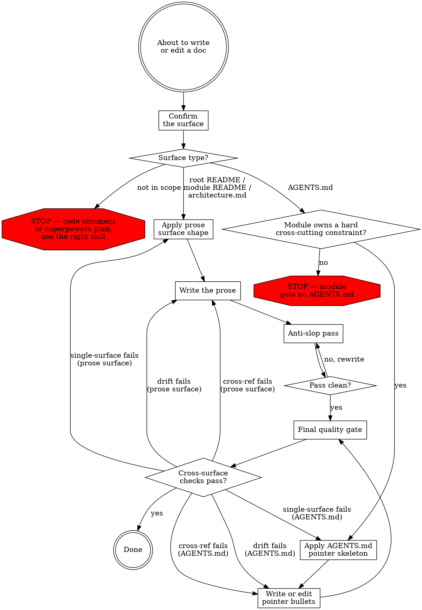

# Writing Docs

cc-port documentation has a single shared invariant: **no sentence appears on more than one surface**. The authored surfaces split by audience:

- **Human-targeted prose** — root `README.md`, module `README.md`, `docs/architecture.md`. Audience is an experienced Go developer reading for task-fit.
- **LLM-targeted pointer maps** — module `AGENTS.md`. Audience is the agent navigating the module before edits.

Out of scope here: code comments (`writing-go-code` skill — point-of-use *why* lives in code, classified per-comment during code work) and procedural artifacts under `docs/superpowers/`.

## Workflow

### Confirm the surface

Name the single surface this content belongs on:

- **Root `README.md`** — pitch, install, commands, development pointer, license. User-facing.
- **Module `README.md`** — developer narrative for a module: Purpose / Public API / Contracts / Quirks / Tests.
- **`docs/architecture.md`** — cross-module narrative, layout tree, invariant ownership index, cross-cutting policies framing.
- **Module `AGENTS.md`** — LLM-targeted pointer map into the adjacent README. Pointer-only; no summaries.

If the content is a point-of-use *why* in code (a comment) or a procedural plan/spec under `docs/superpowers/`, this skill does not apply. STOP and use the correct surface authoring path.

The next steps branch by surface type. Apply only the branch that matches.

### Apply the surface shape

**Human prose surfaces** (root README / module README / `docs/architecture.md`). Each has a fixed shape that is not yours to refine mid-edit. Load `references/surface-shapes.md` for the Module README §Contracts skeleton (Handled / Refused / Not covered, residual-risk lists verbatim), the §Limitations anti-pattern (constraints enforced by code belong under §Contracts, not §Limitations), the short README shape for modules with no owned invariant, the `docs/architecture.md` layout (cross-module narrative, invariant-to-owner table, cross-cutting policies framing), and the root README structure.

**AGENTS.md.** Before touching the file at all, verify the module owns at least one hard cross-cutting constraint that an editor must know before changing code. A module without one gets no AGENTS.md — a ceremonial AGENTS.md is noise. If the file should not exist, STOP and propose its deletion. Otherwise, load `references/agents-md.md` for the pointer-bullet skeleton (`## Before editing` section, 3-8 bullets, ≤30 lines hard ceiling) and the CLAUDE.md companion convention.

### Write the content

**Human prose surfaces.** Apply while writing, not as a retroactive pass: sentences ≤25 words averaging 12-17, active voice predominant, paragraphs ≤4 sentences, headings that predict their content. Define project-specific jargon once at `docs/architecture.md` §<term> and never re-define; leave Go stdlib and language vocabulary undefined since the audience is not a novice. Include a number only when the reader cannot derive it from surrounding text. Reject Flesch-Kincaid 8-12 rewrites — developer docs target FK 10-14. Reject "prefer diagrams" mandates — add a diagram only when a table cannot express the relationship.

Load `references/writing-style.md` for the keep-vs-strip examples for numbers, the worked rejections of consumer-readability heuristics, and the heading-predicts-content failure modes.

**AGENTS.md.** Write pointer bullets, not prose. Every bullet under `## Before editing` ends with `(README §<heading name>)` pointing at a real heading in the adjacent README. No motivation in the bullet — motivation lives in the README; AGENTS.md only points at it. Front-load by stakes: the first bullet under `## Before editing` carries the most attention weight, so order by stakes rather than by source-file order. Cross-refs use `§<heading name>`, never line numbers, never anchor links — headings survive edits, line numbers don't.

The `references/agents-md.md` reference loaded above carries the banned-pattern examples (no motivation, no line-numbered cross-refs, no abbreviations that drift from the identifiers they reference) and the worked WRONG/CORRECT pairs.

### Anti-slop pass

**Skip this step for AGENTS.md.** AGENTS.md is bullet pointers, not prose; the slop fingerprint does not apply.

For human prose surfaces, after the draft is in place, run a literal scan against the slop fingerprint. Search for em (—) and en (–) dashes and remove every instance. Re-read each word against the banned vocabulary lists. Check for banned sentence patterns and description formats. Vary sentence rhythm. Replace abstractions with specifics — name the function, the flag, the file, the limit.

Load `references/anti-ai-slop.md` for the banned vocabulary tables (verbs / adjectives / nouns / adverbs / intensifiers), the banned sentence patterns (contrastive reframe, hedging filler, formulaic transitions, summary openings, "this" + abstract noun, rule of three), the banned description formats, the sentence-rhythm and concreteness examples, and the tone and formatting discipline.

Rewrite affected text and re-check. Do not exit this step until the draft passes every check.

### Final quality gate

Three cross-surface checks. Run them after the surface-specific work above is complete:

**Single-surface principle.** No sentence appears on more than one surface. For each paragraph (human prose) or bullet (AGENTS.md) in the diff, scan whether the same content already lives on another surface (root README / module README / `docs/architecture.md` / AGENTS.md / code comments). If it does, replace this one with a `(README §X)` or `(architecture.md §Y)` pointer, or delete the duplicate at the other surface — keep the version on the surface that already owns the invariant. Common drifts: a module README §Contracts row restated as a code comment above the enforcing line; a cross-cutting policy in `docs/architecture.md` repeated in the owning module's README; an AGENTS.md bullet that summarizes its README pointer instead of pointing at it.

**Cross-ref integrity.** If you renamed any heading on this surface, search for `§<old name>` across every surface type and update every cross-ref in the same edit. Module AGENTS.md files cross-ref README headings by name, so a heading rename without an AGENTS.md sweep silently breaks the pointer map. Module READMEs and `docs/architecture.md` index rows cross-ref each other the same way.

**Code-vs-claim sweep.** For each contract row or behavior claim in the diff (this surface or any cross-ref'd surface), verify the code currently enforces it. A contract that says "X is rewritten through Y" must match what the function the contract names actually does; an AGENTS.md bullet that says "wrap Z in W before any write" must match the function bodies the bullet points at. A claim drifted from the code is a half-fixed doc — either fix the doc to match current code, or fix the code to match the contract — but a doc edit that ships drifted is a regression, not a doc fix.

If single-surface fails, return to *Apply the surface shape*: keep the content on the surface that already owns the invariant, delete the duplicate, and replace it with a pointer at the second site. If cross-ref integrity fails, return to *Write the content* and update every `§<old name>` cross-ref in the same edit. If code-vs-claim drift fails, return to *Write the content* and reconcile the doc with current code; escalate to a code change if the contract is intended to drive the implementation rather than describe it.
