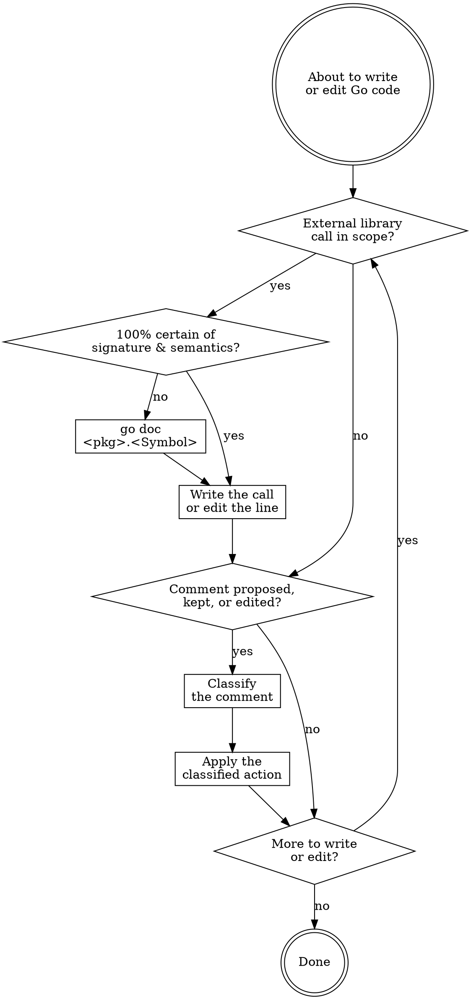

# Writing Go Code

## Workflow

### Confirm the API call

Before writing or editing a call to any Go library symbol — stdlib or third-party — ask: am I 100% certain of this symbol's signature, error behavior, and edge-case semantics, or am I pattern-matching from training? Builtins (`len`, `append`, `cap`, `make`, `delete`, `copy`) proceed. Anything else: `go doc <pkg>.<Symbol>` first.

Skip when: the call mechanically repeats an idiom already established in the same file, or the call already compiles and a test exercising it passes.

Load `references/go-doc.md` for the query-shape table (single symbol vs `-short` vs package overview vs full dump with sizes), the escalation criteria to `-src`, and the don't-consult exceptions.

### Classify each comment

Default: write no comment. Only write or keep one when it carries point-of-use *why* — a hidden constraint, subtle invariant, bug workaround, or deliberate tradeoff that the reader cannot infer from the code. When deleting code, also delete any why-comment above it; an orphaned why is dead weight.

For every comment proposed, kept, or edited, classify it and apply the listed action. Load `references/comments.md` for the full classification table (load-bearing why / exported godoc / explains-what / tutorial / over-specified / redundant-with-README), a worked load-bearing-why example, the banned-pattern examples (no `// see README §X` backlinks, no line-numbered cross-refs), and the godoc compression rule for exported symbols.
