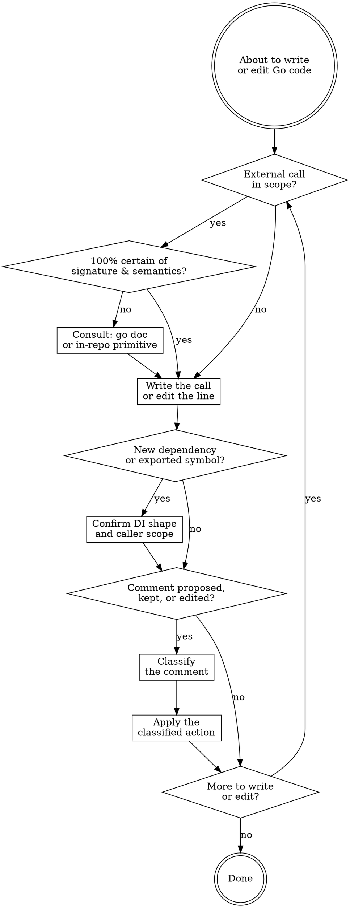

# Writing Go Code

## Workflow

### Confirm the API call

Before writing or editing a call to any Go library symbol — stdlib or third-party — ask: am I 100% certain of this symbol's signature, error behavior, and edge-case semantics, or am I pattern-matching from training? Builtins (`len`, `append`, `cap`, `make`, `delete`, `copy`) proceed. Anything else: `go doc <pkg>.<Symbol>` first.

Skip when: the call mechanically repeats an idiom already established in the same file, or the call already compiles and a test exercising it passes.

Load `references/go-doc.md` for the query-shape table (single symbol vs `-short` vs package overview vs full dump with sizes), the escalation criteria to `-src`, and the don't-consult exceptions.

When the call would mutate path-shaped strings, edit a user-owned config file, or scan untrusted bytes, the project usually wraps the stdlib primitive in a domain helper that carries the right invariants. Search the repo for the helper before reaching for the stdlib call directly. `go doc` confirms the call works the way you remember; the in-repo lookup confirms it's the right call to make at all. Load `references/in-repo-primitives.md` for the lookup table and the decision test.

### Confirm dependencies and surface scope

After the line is written or edited, two architectural checks fire before moving to comments. Skip both when the edit is a single statement inside an existing function that introduces neither a new dependency nor a new exported symbol.

**Dependency entry shape.** When the line introduces a new dependency — a callable, an external service, configuration, time source, randomness source, output stream — does the function obtain it via parameter, option, or constructor field, or does it reach for it (package-level `var`, free `os.Getenv`, hidden singleton, in-line `os.Stdout`)? Reach-for forms hide test seams and force globals to grow. Default to parameter or option entry. Reach for only when the value is genuinely process-wide and unconfigurable, and even then prefer a package-level seam (`var stdoutWriter io.Writer = os.Stdout`) over an in-line reference so a test can swap it under `t.Cleanup`.

**Caller scope for new exported symbols.** When the line adds a new exported symbol (function, method, type, var, const, field), the same coordinated unit of work must add at least one non-test caller. The unit is the smallest closed change that ships together: a single PR for unchained work, or a chain of dependent plans, specs, and PRs that share a feature when the work spans multiple commits. A symbol with no caller anywhere in the unit is scaffolding — delete it, or hold the export until the caller is part of the same coordinated change. Holding is acceptable; speculative exports are not.

### Classify each comment

Default: write no comment. Only write or keep one when it carries point-of-use *why* — a hidden constraint, subtle invariant, bug workaround, or deliberate tradeoff that the reader cannot infer from the code. When deleting code, also delete any why-comment above it; an orphaned why is dead weight.

For every comment proposed, kept, or edited, classify it and apply the listed action. Load `references/comments.md` for the full classification table (load-bearing why / exported godoc / explains-what / tutorial / over-specified / redundant-with-README), a worked load-bearing-why example, the banned-pattern examples (no `// see README §X` backlinks, no line-numbered cross-refs), and the godoc compression rule for exported symbols.
