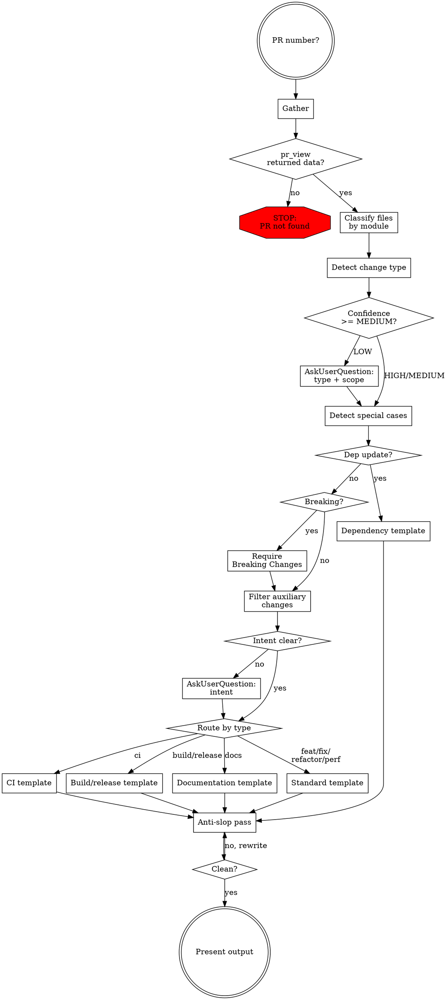

# Writing PR Descriptions

## Requirements

- **PR number**: a positive integer. Ask if missing.
- **Working directory**: cc-port repository root, on any branch (the data is fetched via gh-tooling, not the local working tree).
- The PR must exist and be visible to the configured gh-tooling MCP.

## Workflow



### Gather

Call in this order (gh-tooling MCP, not the gh CLI):

| Tool | Purpose |
|---|---|
| `pr_view` | Title, body, labels, base/head refs, author |
| `pr_files` | Changed file list with status (added / modified / removed / renamed) |
| `pr_diff` | The actual diff text |
| `pr_commits` | Commit subjects on the PR |

If `pr_view` returns nothing, stop and report the PR number as not found.

The full diff is the primary source. The description must not contain a change the diff does not show.

### Classify files by module

Group the changed files. Modules are taken from `AGENTS.md` §Navigation; categories below add cross-cutting buckets.

| Category | Path patterns |
|---|---|
| CLI | `cmd/cc-port/**` |
| `move` command | `internal/move/**` |
| `export` command | `internal/export/**` |
| `import` command | `internal/importer/**` |
| Manifest | `internal/manifest/**` |
| Rewrite primitive | `internal/rewrite/**` |
| Lock primitive | `internal/lock/**` |
| Filesystem primitive | `internal/fsutil/**` |
| Claude state primitive | `internal/claude/**` |
| Scan primitive | `internal/scan/**` |
| UI primitive | `internal/ui/**` |
| Other internals | `internal/**` not matched above |
| Tests | `*_test.go`, `testdata/**` |
| CI | `.github/workflows/**`, `.github/actions/**` |
| Build / Release | `.goreleaser.yml`, `Makefile`, packaging |
| Documentation | `*.md`, `docs/**`, `AGENTS.md`, `CLAUDE.md`, `README.md`, `DEVELOPMENT.md` |
| Config | `go.mod`, `go.sum`, `.golangci.yml`, `.editorconfig`, repo-root configs |

### Detect change type

See `references/type-detection.md` for the decision tree, project-specific type guidance, scope rules, confidence levels, and breaking-change indicators. Apply the rules to the file classification from the previous step.

- HIGH / MEDIUM confidence: use the type and scope directly.
- LOW confidence: `AskUserQuestion` with the candidate types from the analysis. Confirm both type and scope before proceeding.

### Detect special cases

**Dependency-update PRs**:

- Author is `renovate[bot]` or `dependabot[bot]`, or the change is exclusively `go.mod` / `go.sum`.
- The dependency-update flag overrides the type-derived template.

**Breaking changes**: see the Breaking-Change Detection section in `references/type-detection.md`. When any indicator triggers, the description must include a `## Breaking Changes` section with migration guidance regardless of which template is selected.

### Filter auxiliary changes

Tests and documentation support the main change. They are not mentioned as items unless the PR is exclusively about them.

| PR contains | Mention tests? | Mention docs? |
|---|---|---|
| Only tests | Yes | n/a |
| Only docs | n/a | Yes |
| Code + tests | No | n/a |
| Code + docs | No | No |
| Code + tests + docs | No | No |

A test or doc change that captures a *behaviour change* (a new invariant test, a new contract row in a module README) belongs in the description because it documents the contract, not the housekeeping. Use judgement.

### Resolve unclear intent

If the reason for the change is still unclear after reading the diff, ask the user via `AskUserQuestion`. Do not guess.

Signs of unclear intent:

- Commit subjects are vague (`fix`, `update`, `cleanup`).
- Mixed changes across unrelated modules with no shared theme.
- Deleted code with no obvious replacement.
- Renames or moves with no explanation in the commits.

### Apply template

Route by the type from "Detect change type" and the flags from "Detect special cases". The dependency-update flag overrides the type:

| Selector | Template |
|---|---|
| Dependency-update flag set | Dependency |
| type=ci | CI-only |
| type=build or type=release | Build/Release |
| type=docs | Documentation-only |
| otherwise (feat / fix / refactor / perf) | Standard |

Focus the Summary on user-visible effect (commands, flags, behaviour) rather than internal mechanics, unless the PR's whole point is the internal mechanic. Name specifics: function names, flag names, file paths, exact limits, not abstractions.

**Standard:**

```markdown
## Summary

{1-3 sentences. Start with an action verb. State what changed and why it matters to a user of cc-port.}

## Changes

### {Category 1}

- {Bullet describing one change. Use specifics: command names, flag names, module names, exact behaviour.}
- {Another change in the same category.}

### {Category 2}

- {Change description.}

{If breaking changes:}

## Breaking Changes

{What breaks. Migration path. Include the before/after command or code snippet.}
```

**CI-only:**

```markdown
## Summary

{One sentence describing the workflow or pipeline change and why.}
```

**Build/Release:**

```markdown
## Summary

{One sentence describing the packaging, goreleaser, or build change and why.}
```

**Documentation-only:**

```markdown
## Summary

{What was added or revised, and why. Reference the surface (README, docs/architecture.md, module README) by name.}
```

**Dependency:**

```markdown
## Summary

Updates dependencies.

## Updated Dependencies

| Package | From | To |
|---|---|---|
| {package} | {old} | {new} |
```

### Anti-slop pass

PR descriptions are user-facing prose. Re-read `references/writing-rules-anti-ai-slop.md` and check the draft literally:

1. Search for em dash (—) and en dash (–). Remove every instance.
2. Re-read each word against the banned vocabulary list.
3. Check for banned sentence patterns: "This PR introduces…", "It's worth noting…", contrastive reframes, summary openings.
4. Vary sentence rhythm.
5. Replace abstractions with specifics: name the function, the flag, the file, the limit.

Rewrite affected text and re-check. Do not exit this step until the draft passes every check.

### Present

Output:

1. A header: `**Suggested Title:** {type}({scope}): {subject}` followed by file count and detected type.
2. The description inside a fenced markdown block.
3. Offer to copy the description (without fences) to the clipboard via `pbcopy` (macOS) or `xclip -selection clipboard` (Linux). Ask first.

The session's gh-tooling MCP is read-only. The user applies the description themselves; do not attempt to mutate the PR via gh-tooling or the gh CLI.
