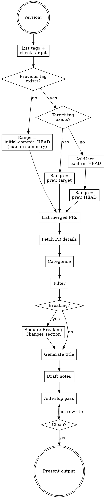

# Writing Release Notes

## Requirements

- **Version**: a tag like `v0.5.0`. Ask if missing. Accept with or without leading `v`; emit canonical `v` form in output.
- **Working directory**: cc-port repository root.
- Repository must be a git checkout with tags fetched (`git fetch --tags` if unsure).
- cc-port releases are tag-driven via goreleaser; there is no release PR to read from. Aggregate from the tag range.

## Workflow



### Resolve version range

Run in parallel:

```bash
# Sorted tags, newest first
git tag --sort=-v:refname

# Whether the target tag exists locally
git rev-parse "refs/tags/<version>" 2>/dev/null || echo TAG_NOT_FOUND
```

From the sorted tag list, pick the tag immediately before `<version>`.

- Target tag exists, previous tag exists: range is `<prev>..<version>`.
- Target tag does not exist, previous tag exists: range is `<prev>..HEAD`. `AskUserQuestion` to confirm `HEAD` is the intended endpoint before proceeding.
- No previous tag (first release): range is `<initial-commit>..HEAD`. Note this in the Summary.

When the range is otherwise ambiguous (two plausible previous tags, unusual tag pattern), confirm with the user before continuing.

### List merged PRs

Run:

```bash
git log <range> --pretty=format:"%H %s" --no-merges
git diff <range> --stat
```

Extract PR numbers from commit subjects. cc-port commits land via squash-merge with the trailing `(#N)` suffix added by GitHub.

For commits without a trailing `(#N)` (direct pushes from before the PR workflow), include the commit subject verbatim and treat the commit as its own change unit.

### Fetch PR details

For each PR number, call gh-tooling `pr_view` to read title, body, and labels. For ambiguous commits without PRs, call gh-tooling `commit_pulls` with the commit SHA to confirm whether a PR exists.

Every line in the eventual draft must trace to a PR body, a commit subject, or a diff hunk read here. Do not invent change descriptions or migration steps.

### Categorise

Map each PR to one cc-port category. Use the conventional-commit prefix on the PR title as the primary signal, falling back to changed paths.

| Category        | Prefix or path signal                          |
|-----------------|------------------------------------------------|
| Features        | `feat:`, `feat(scope):`                        |
| Fixes           | `fix:`, `fix(scope):`                          |
| Refactors       | `refactor:`                                    |
| Performance     | `perf:`                                        |
| Build / Release | `build:`, `.goreleaser.yml`, packaging         |
| CI              | `ci:`, `.github/workflows/`                    |
| Documentation   | `docs:`, `README.md`, `docs/`, `AGENTS.md`     |
| Dependencies    | `deps:`, `chore(deps):`, `go.mod`, `go.sum`    |
| Tests           | `test:`, only `*_test.go` files touched        |
| Chore           | `chore:` and anything not covered above        |

Group by cc-port module under each category when more than two PRs share a module. Modules are listed in `AGENTS.md` §Navigation.

### Filter

Exclude from the user-facing notes:

- Version-bump-only commits (the release implies them).
- Test-only PRs unless the release is test-focused.
- Internal refactors with no observable effect, unless they unblock something the user cares about.
- Renovate / Dependabot dep bumps with no functional change. Roll them into a single `Dependencies` line with the count.

### Detect breaking changes

Mark a PR as breaking if any apply:

- PR body contains `BREAKING CHANGE:` or title carries `!` after the type.
- Removed CLI subcommand or flag (check `cmd/cc-port` diffs).
- Removed or renamed exported symbol that another module references.
- Changed manifest XML schema in a way that older archives no longer load.
- Changed lock-file or session-keyed registry contracts (see `internal/lock/README.md`, `internal/claude/README.md`).

If any breaking change is present, the notes must include `### Breaking Changes` with migration guidance.

### Generate title

A descriptive 3-6 word title that captures the release theme.

- Single-focus release: name the main change. Example: `Manifest XML Validation`.
- Multi-feature release: combine themes. Example: `Import Cap Guards & Homebrew Cask`.

### Draft notes

Use this exact skeleton:

```markdown
## v{version} - {Title}

### Summary

{1-3 sentences. Start with an action verb. Name the user-visible effect.}

### Changes

#### {Category}

- {Description starting with an action verb. Name the user-visible effect.} (#{pr-number})

{repeat per category}

### Breaking Changes

{Only if any. Describe what breaks and the migration path. Include code or command examples when they shorten the explanation.}

### Upgrade Notes

{Either concrete upgrade steps, or the literal line: `No breaking changes.`}
```

Format rules:

- Title line is `## v{version} - {Title}`. Becomes the GitHub release title.
- Categories use `####`. Omit a category if it has no entries.
- Sort categories in the order listed in the Categorise step. Within a category, order by user impact: features first, then incremental polish.
- One bullet per PR. Combine only when the same PR contributes to multiple subareas under one category.
- Plain prose bullets. Lead with an action verb (`Add`, `Fix`, `Refactor`, `Reduce`); trail with the PR reference in parentheses. Do not bold a change name and follow with a colon. The `- **Title**: description.` pattern reads as AI slop.
- Code examples for new commands or flags belong inline under the relevant bullet.
- Cite each change with its PR number where one exists.
- Always include the `### Upgrade Notes` section. Use the literal `No breaking changes.` when no migration applies.
- No "Generated with Claude Code" footer. Release notes carry no attribution.

### Anti-slop pass

The release notes are user-facing prose. Re-read `references/writing-rules-anti-ai-slop.md` and check the draft literally:

1. Search for em dash (—) and en dash (–). Remove every instance.
2. Re-read each word against the banned vocabulary list.
3. Check for banned sentence patterns and hedging filler.
4. Scan for `- **Title**: description.` bullets. Rewrite them as plain prose bullets that lead with an action verb.
5. Vary sentence rhythm. Do not let every bullet be the same length.

Rewrite affected text and re-check. Do not exit this step until the draft passes every check.

### Present

Output:

1. A short header: version, previous tag, PR count.
2. The release notes inside a fenced markdown block so the user can copy-paste.
3. Offer to copy the notes (without fences) to the clipboard via `pbcopy` (macOS) or `xclip -selection clipboard` (Linux). Ask first.

The session's gh-tooling MCP is read-only. The user applies the notes themselves; do not attempt to mutate the release via gh-tooling or the gh CLI.
