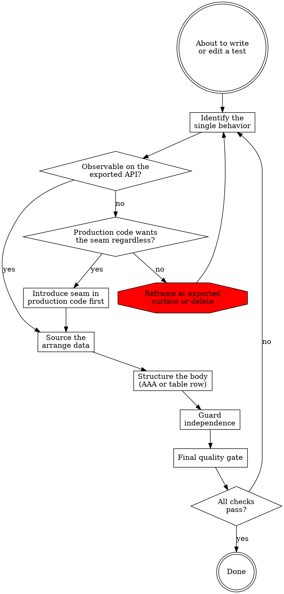

# Writing Tests

cc-port tests use `testutil.SetupFixture(t)` against `testdata/dotclaude/` and `codex.SetupFixture(t)` against `internal/tool/codex/testdata/dotcodex/`. testify `require` for preconditions, `assert` for behavioral claims after the act. Table-driven via `t.Run`.

## Workflow

### Identify the single behavior

Articulate the behavior in one sentence using business language. The test name is a paraphrase of that sentence (`TestApplyRelocatesProjectDir`, not `TestFilepathJoinUsage`). If the sentence contains `and`, you have two tests. If it names an implementation choice (which dependency was called, internal call order, algorithmic decomposition), you have no test.

When the behavior is real but not observable through the current exported API, the diamond branches three ways: introduce a production-code seam (an `io.Writer` parameter, a constructor-injected dependency, an exported pure helper, or a package-level fn-var the test swaps under `t.Cleanup`) so the behavior becomes observable through the seam; reframe the test at an exported surface that already covers the behavior; or delete the candidate as implementation detail. Choose seam-introduction only when the seam will outlive the test — when production code wants the injection point regardless of testability. A seam introduced solely to test through is the same `package foo` internal-test smell, dressed in a `With*` option.

Load `references/behavior.md` and classify the candidate against the do-test / don't-test list, the carve-outs (`package foo` for invariants that cannot be observed externally; constructors that validate or transform; drift-guard tests that assert registry parity), and the four seam patterns surfaced by past coverage work.

### Source the arrange data

A reader of only this test must be able to tell what the inputs are and where they came from. Choose one source:

- `testutil.SetupFixture(t)` — staged `~/.claude` tree
- a sibling `testdata/<name>` file or `//go:embed testdata/<name>` — parser/scanner input ≥10 lines
- inline literal — single-line input, malformed-shape test, narrow unit
- `t.TempDir` — fresh empty filesystem state
- `//go:build large`-gated production-scale input — adversarial-scale fixtures (hundreds of MiB or multi-GiB) that exercise cap-rejection or aggregate-size guards. Pair every `large`-gated test with a small-cap CI variant (1-2 MiB caps via test-side overrides) that exercises the same branches at trivial cost.

Load `references/data.md` for the acceptable-vs-flagged paths table (absolute paths, cross-package fixture borrow, dynamic globs), the descriptive-name conventions for project paths and session IDs, the 5-line / 3-occurrence rule for helper extraction with `t.Helper()` placement, and the small-cap pairing pattern for `//go:build large` tests.

### Structure the body

Pick the shape: AAA-separated body for 5+ statements, or table-driven subtest body of 2-3 statements. Then write the body without conditional logic that picks between assertions. If you reach for an `if`/`switch`/loop branch on a test expectation, stop — either you need the `wantErr` carve-out (success-path assertions identical across rows), or you need to split into two test functions.

Load `references/shape.md` for the `wantErr` pattern, the platform-skip and short-mode carve-outs that are not violations, the assertion-scope rule (multiple assertions only when they verify one logical behavior), and the naming and ordering conventions.

### Guard independence

Ask: would `-shuffle=on`, `-run=TheOtherTest`, or future `t.Parallel()` adoption change the outcome? If yes, the test depends on state outside its body.

Load `references/independence.md` for the four leak vectors (package-level vars, subtest closure capture, unrestored globals, wall-clock/randomness in asserted values), the allowed clock and PRNG contexts, and the `t.Cleanup` restoration pattern for any global mutation.

### Final quality gate

Two checks span individual steps and are most often skipped. Run them after the body is drafted:

**Redundancy.** Every test case (table row) and every top-level test covers a unique code path, boundary value, or regression. Key on *why* the case exists, not on *what* the input looks like. Three rows that exercise the same branch with different magnitudes is one case. Before flagging a row as redundant, scan its name and any nearby comment for `Regression`, `Bug`, `Issue`, `#\d+`, `GH-`, or `PR-` markers; if present, keep the row and add an explanatory comment. The full preservation table lives in `references/behavior.md` §DESIGN-004.

**Guard-clause isolation.** When the test targets one early-return in a function with multiple sequential guards, the arrange satisfies every other guard so the tested guard is the only possible exit. Open the public function under test, enumerate its sequential guards, and verify the arrange satisfies all guards above the targeted one. Otherwise the test passes through the wrong guard and proves nothing. The worked example with three sequential guards lives in `references/behavior.md` §DESIGN-010.

If either check fails, return to the relevant step. Redundancy points back to step 1 (the row may be reframable to a unique branch); guard-clause failure points back to step 2 (the arrange needs more setup).
