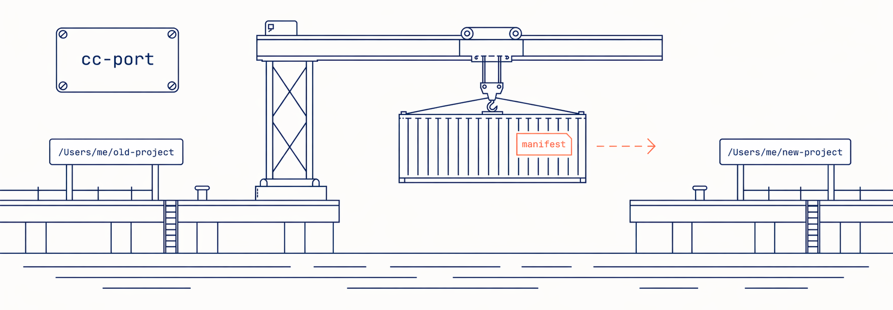

`cc-port` rewrites Claude Code project state after a rename, an export, or an import. Moving a project directory on disk or handing it to a teammate invalidates the absolute paths baked into `~/.claude/projects/<encoded>/`, `~/.claude/history.jsonl`, and `~/.claude.json`. cc-port rewrites the references safely: boundary-aware substring replacement, atomic writes with rollback, and a lock-plus-live-session check. No operation collides with a running Claude Code process.

> [!CAUTION]
> cc-port is experimental. Don't use it in production yet. Data loss or corruption may happen. Back up `~/.claude/` before running any mutating command.

## Install

Homebrew (macOS only):

```
brew install it-bens/tap/cc-port
```

Linux users, or those who prefer a source install, can use `go install`:

```
go install github.com/it-bens/cc-port/cmd/cc-port@latest
```

Prebuilt releases (macOS / Linux tarballs, checksums) are published under [GitHub Releases](https://github.com/it-bens/cc-port/releases).

## Commands

Full flag reference: `cc-port <subcommand> --help`. `cc-port --version` prints the build version.

### `cc-port move`

`cc-port move <old-path> <new-path> [--apply] [--refs-only] [--rewrite-transcripts]`

Rewrite every reference to `<old-path>` under `~/.claude/` to `<new-path>`. Default is dry-run. `--apply` copies, verifies, then deletes the old encoded directory. `--refs-only` updates references only and leaves the project directory in place on disk. `--rewrite-transcripts` also rewrites paths inside session transcripts.

```
cc-port move /Users/me/old-project /Users/me/new-project --apply
```

### `cc-port export`

`cc-port export <project-path> --output <archive.zip>`

Produce a portable archive of one project. Use `--all` or individual category flags (`--sessions`, `--memory`, `--history`, `--file-history`, `--config`, `--todos`, `--usage-data`, `--plugins-data`, `--tasks`). Omit all flags for an interactive picker.

Optional passphrase encryption via `--passphrase-env` or `--passphrase-file` (mutually exclusive). Plaintext stays the default. The read side detects encryption from the archive's magic bytes.

```
cc-port export /Users/me/project --output /tmp/project.zip --all
```

### `cc-port export manifest`

`cc-port export manifest <project-path> [-o|--output <manifest.xml>]`

Emit only the manifest for review or editing. Feed it back via `--from-manifest` on a subsequent `export` or `import`. Refuses to overwrite an existing output path.

```
cc-port export manifest /Users/me/project --output /tmp/project.xml
```

### `cc-port import`

`cc-port import <archive.zip> <target-path>`

Apply an archive to `<target-path>`. Placeholder resolutions come from `--resolution KEY=VALUE` flags or from a manifest via `--from-manifest`. When both are passed, `--resolution` values win per key.

Optional passphrase decryption via `--passphrase-env` or `--passphrase-file` (mutually exclusive). Plaintext stays the default. The read side detects encryption from the archive's magic bytes.

```
cc-port import /tmp/project.zip /Users/teammate/project
```

### `cc-port import manifest`

`cc-port import manifest <archive.zip> [-o|--output <manifest.xml>]`

Read the metadata from an archive and write a manifest XML with empty resolve attributes for hand-editing. Feed it back via `--from-manifest` on a subsequent `import`. Refuses to overwrite an existing output path.

Optional passphrase decryption via `--passphrase-env` or `--passphrase-file` (mutually exclusive). Plaintext stays the default. The read side detects encryption from the archive's magic bytes.

```
cc-port import manifest /tmp/project.zip --output /tmp/project.xml
```

### `cc-port push`

`cc-port push <project-path> --as <name> --remote <url> [--apply] [--force] [--passphrase-env <NAME> | --passphrase-file <PATH>] [--from-manifest <path>] [--all | <category flags>]`

Push the project at `<project-path>` to the remote at `<url>` under the stable name `<name>`. Dry-run by default. `--apply` commits the upload. `--force` overrides the cross-machine conflict refusal. Categories and placeholders mirror `cc-port export`: `--from-manifest` loads both from a manifest file; otherwise category flags select what to include and the export prompts for missing placeholders on a TTY. Pre-build a manifest via `cc-port export manifest` for non-interactive use.

```
cc-port push /Users/me/project --as project --remote s3://bucket?region=us-east-1 --apply
```

### `cc-port pull`

`cc-port pull <name> --to <target-path> --remote <url> [--apply] [--passphrase-env <NAME> | --passphrase-file <PATH>] [--resolution KEY=VALUE ...] [--from-manifest <path>]`

Pull the archive named `<name>` from `<url>` and apply it to `<target-path>`. Dry-run by default. `--apply` commits the import. `--resolution` and `--from-manifest` follow the same contract as `cc-port import`.

```
cc-port pull project --to /Users/me/teammate-project --remote s3://bucket?region=us-east-1 --apply --resolution HOME=/Users/me
```

## Development

Contributing or modifying cc-port? See [`DEVELOPMENT.md`](DEVELOPMENT.md) for architecture, tests, lint, and commit conventions.

## License

See [`LICENSE`](LICENSE).

---

> [!NOTE]
> Yes, an AI wrote this README. And everything else as well. A human with ADHD steers it. His brain ran on associative pattern-matching and nonlinear leaps long before LLMs made it cool. They call him ... LLMartin.
