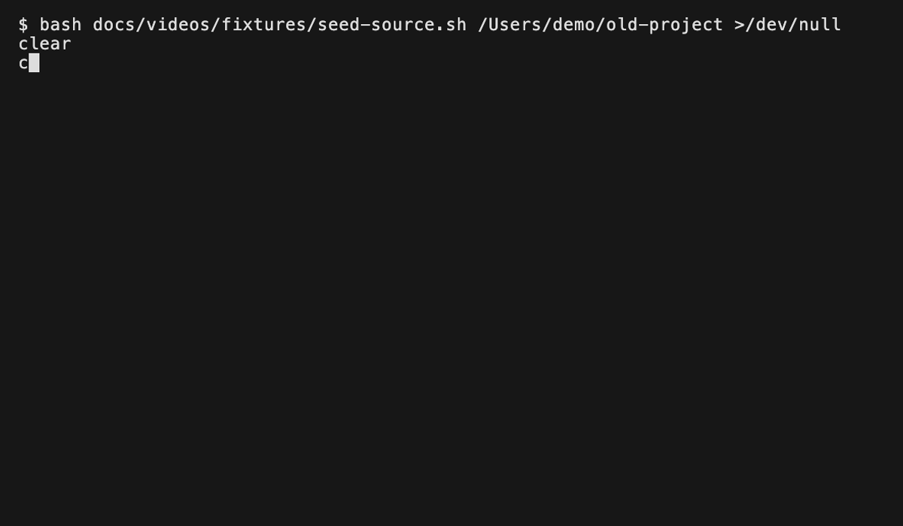
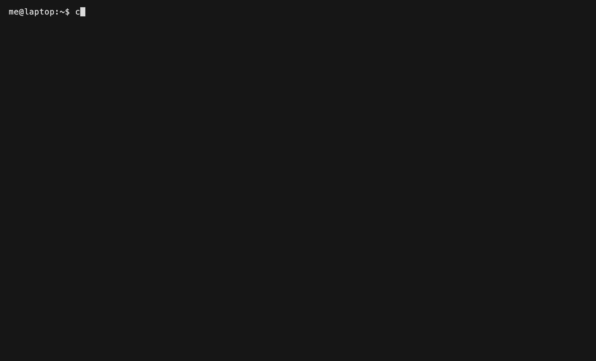

`cc-port` ports Claude Code and OpenAI Codex project state after a rename, an export, or an import. Moving a project directory on disk or handing it to a teammate invalidates the absolute paths baked into each tool's session, history, and config files. cc-port rewrites the references safely across every installed tool: boundary-aware substring replacement, SQL-level rewriting for Codex's SQLite index, and atomic writes with rollback. Every command that mutates a tool's local state (`move --apply`, `import`, `pull --apply`) locks and refuses while a Claude Code session or Codex process is live, while `export`, `push`, and `stats` read local state without a lock and `push` writes only to the remote you configure, never to local tool state.

> [!CAUTION]
> cc-port is experimental. Don't use it in production yet. Data loss or corruption may happen. Back up `~/.claude/` and `~/.codex/` before running any mutating command.

## Install

Homebrew (macOS only):

```
brew install it-bens/tap/cc-port
```

Linux users, or those who prefer a source install, can use `go install`:

```
go install github.com/it-bens/cc-port/cmd/cc-port@latest
```

Prebuilt releases (macOS / Linux tarballs, checksums) are published under [GitHub Releases](https://github.com/it-bens/cc-port/releases).

## Verify a release

Release artifacts are signed by the GitHub Actions release workflow with cosign keyless OIDC. Every release ships `checksums.txt` and a sigstore bundle `checksums.txt.sigstore.json` alongside the tarballs. Verify the checksums file first, then match each downloaded archive against it.

```
cosign verify-blob \
  --bundle checksums.txt.sigstore.json \
  --certificate-identity 'https://github.com/it-bens/cc-port/.github/workflows/release.yml@refs/tags/<vX.Y.Z>' \
  --certificate-oidc-issuer 'https://token.actions.githubusercontent.com' \
  checksums.txt
```

Replace `<vX.Y.Z>` with the release tag. After `checksums.txt` is verified, run `sha256sum -c checksums.txt` (or `shasum -a 256 -c checksums.txt` on macOS) against the downloaded archives.

## Builds

cc-port ships as two binaries built from the same source:

- `cc-port`: default, no banner output. `go build ./cmd/cc-port` or `brew install it-bens/tap/cc-port`.
- `cc-port-with-logo`: variant, renders a colored gantry-crane logo on `--help`, `--version`, and the interactive picker. `go build -tags logo -o cc-port-with-logo ./cmd/cc-port` or `brew install it-bens/tap/cc-port-with-logo`.

Functionally identical otherwise; pick whichever you prefer. Pre-built tarballs of both are attached to every [GitHub release](https://github.com/it-bens/cc-port/releases).

## Commands

Full flag reference: `cc-port <subcommand> --help`. `cc-port --version` prints the build version.

Every data command (`move`, `export`, `import`, `push`, `pull`, `stats`) sweeps every detected tool by default. `--tool <name>` (repeatable) narrows the run to one or more named tools; an undetected tool named explicitly fails instead of being skipped. `--claude-home <dir>` and `--codex-home <dir>` override each tool's default state location (`~/.claude` and `~/.codex`), and are rejected if their tool is not selected for the run.

Persistent progress flags are available on every subcommand: `--quiet` (`-q`) suppresses progress and shows only errors; `--verbose` adds detail lines and `--debug` adds more, neither with a shorthand; `--json` emits progress as newline-delimited JSON instead of human output, which wins over a terminal. By default progress renders live on a terminal and as plain append-only lines when stderr is redirected. `stats` has no progress phases; there `--json` instead switches its single result table to one indented JSON document.

### `cc-port move`



`cc-port move <old-path> <new-path> [--apply] [--refs-only] [--deep] [--tool <name>]`

Rewrite every reference to `<old-path>` to `<new-path>`, across every detected tool. Default is dry-run. `--apply` copies, verifies, then deletes the old encoded directory (Claude) or rewrites the relevant SQLite and TOML state in place (Codex). `--refs-only` updates references only and leaves the project directory in place on disk. `--deep` also rewrites paths inside narrative bodies such as session transcripts.

When the selected tools only rewrite state references, cc-port warns that none moves the project directory on disk.

```
cc-port move /Users/me/old-project /Users/me/new-project --apply
```

### `cc-port export`


`cc-port export <project-path> --output <archive.zip> [--tool <name>]`

Produce a portable archive of one project, across every detected tool. Use `--all` for every category on every selected tool, or `--include <tool>/<category>` (repeatable) to name specific tool-and-category pairs, for example `--include claude/sessions --include codex/history`. Omit both flags for an interactive picker, grouped by tool.

Optional passphrase encryption via `--passphrase-env` or `--passphrase-file` (mutually exclusive). Plaintext stays the default. The read side detects encryption from the archive's magic bytes.

```
cc-port export /Users/me/project --output /tmp/project.zip --all
```

### `cc-port export manifest`

`cc-port export manifest <project-path> [-o|--output <manifest.xml>] [--tool <name>]`

Emit only the manifest for review or editing, across every detected tool. Feed it back via `--from-manifest` on a subsequent `export` or `import`. Refuses to overwrite an existing output path.

```
cc-port export manifest /Users/me/project --output /tmp/project.xml
```

### `cc-port import`

(See the `cc-port export` section above for an end-to-end export → import demo.)

`cc-port import <archive.zip> <target-path> [--tool <name>]`

Apply an archive to `<target-path>`, across every tool the archive has data for. Non-implicit placeholders are resolved via `--from-manifest`. Each tool supplies its own implicit keys (Claude: `{{PROJECT_PATH}}`, `{{HOME}}`, `{{PROJECT_DIR}}`; Codex: `{{CODEX_HOME}}`, `{{CODEX_PROJECT_PATH}}`); user-supplied resolutions for an implicit key are refused.

Optional passphrase decryption via `--passphrase-env` or `--passphrase-file` (mutually exclusive). Plaintext stays the default. The read side detects encryption from the archive's magic bytes.

```
cc-port import /tmp/project.zip /Users/teammate/project
```

### `cc-port import manifest`

`cc-port import manifest <archive.zip> [-o|--output <manifest.xml>]`

Read the metadata from an archive and write a manifest XML, covering every tool block the archive carries, with empty resolve attributes for hand-editing. Feed it back via `--from-manifest` on a subsequent `import`. Refuses to overwrite an existing output path.

Optional passphrase decryption via `--passphrase-env` or `--passphrase-file` (mutually exclusive). Plaintext stays the default. The read side detects encryption from the archive's magic bytes.

```
cc-port import manifest /tmp/project.zip --output /tmp/project.xml
```

### `cc-port push`



`cc-port push <project-path> --as <name> --remote <url> [--apply] [--force] [--tool <name>] [--passphrase-env <NAME> | --passphrase-file <PATH>] [--from-manifest <path>] [--all | --include <tool>/<category>]`

Push the project at `<project-path>`, across every detected tool, to the remote at `<url>` under the stable name `<name>`. Dry-run by default. `--apply` commits the upload. `--force` overrides the cross-machine conflict refusal. Categories and placeholders mirror `cc-port export`: `--from-manifest` loads both from a manifest file; otherwise `--all`/`--include` select what to include and the export prompts for missing placeholders on a TTY. Pre-build a manifest via `cc-port export manifest` for non-interactive use.

```
cc-port push /Users/me/project --as project --remote s3://bucket?region=us-east-1 --apply
```

### `cc-port pull`

(See the `cc-port push` section above for an end-to-end push → pull demo.)

`cc-port pull <name> --to <target-path> --remote <url> [--apply] [--tool <name>] [--passphrase-env <NAME> | --passphrase-file <PATH>] [--from-manifest <path>]`

Pull the archive named `<name>` from `<url>` and apply it to `<target-path>`, across every tool the archive has data for. Dry-run by default. `--apply` commits the import. `--from-manifest` follows the same contract as `cc-port import`.

```
cc-port pull project --to /Users/me/teammate-project --remote s3://bucket?region=us-east-1 --apply
```

### `cc-port stats`

`cc-port stats [<project-path>] [--tool <name>]`

Report how much of each detected tool's state a project occupies and how entangled its path is across shared files. With a project path, it prints per-surface reference counts and per-category disk usage for every selected tool. With no argument, it ranks every known project, across every tool, by disk footprint. It is read-only: it never writes and takes no lock. The root `--json` flag emits the result as a JSON document instead of the human table.

```
cc-port stats /Users/me/project
```

## Development

Contributing or modifying cc-port? See [`DEVELOPMENT.md`](DEVELOPMENT.md) for architecture, tests, lint, and commit conventions.

## License

See [`LICENSE`](LICENSE).

---

> [!NOTE]
> Yes, an AI wrote this README. And everything else as well. A human with ADHD steers it. His brain ran on associative pattern-matching and nonlinear leaps long before LLMs made it cool. They call him ... LLMartin.
